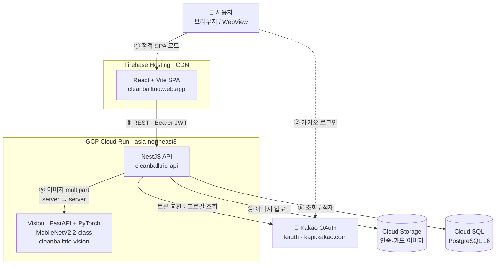

# 용기낼깡 (Clean Ball Trio)

> **야구장 일회용기 쓰레기 문제를, "직관 기념 카드"라는 보상으로 푼다.**

<div align="center">


**Live**: <https://cleanballtrio.web.app>

</div>

---

## 1. 문제 정의

KBO 한 시즌 약 **800만 명**이 직관하고 경기마다 수만 개의 일회용기가 쏟아지지만, 구장 다회용기 시범 운영의 **회수율은 낮다.** 두 가지가 맞물린 결과다.

- **반납 동기가 없다** — 반납해도 돌아오는 게 없으니 "그냥 버리는 게 빠르다"를 이기지 못한다.
- **기여를 증명할 수단이 없다** — 내가 다회용기를 쓰고 반납했다는 사실을 확인·기록할 방법이 없어, 보상도 경쟁도 설계할 수 없다.

## 2. 해결책

용기낼깡은 환경 행동에 **즉각적이고 소장 가치 있는 보상**을 붙인다. 핵심 메커니즘은 한 문장으로 요약된다 — **"다회용기를 인증해야, 그날의 직관 기념 카드(야구네컷)를 만들 수 있다."** 현금성 보상 대신 직관의 추억을 굿즈로 남기고 싶은 욕구를 동기로 활용한다.

| 문제                | 해결                                                                                |
| ------------------- | ----------------------------------------------------------------------------------- |
| 반납 동기 부재      | 다회용기 인증 시 **그날 24시까지 '야구네컷' 직관 카드 제작이 잠금 해제** (인증 게이트) |
| 기여 인증 수단 부재 | **사진 1장 → Vision AI 자동 인증** (QR·운영사 협의 불필요)                           |
| 어뷰징 위험         | RETURN은 같은 사용자의 **12시간 내 USE 기록**이 있어야만 점수 적재                   |

> 점수(`usages.score`)와 경기·구단 데이터는 적재되지만, 현재 사용자에게 노출되는 것은 **순위·점수가 아니라 "오늘 카드 해제 여부"** 다. 누적 랭킹/팀 경쟁은 데이터가 모인 뒤 검토할 백로그.

## 3. 주요 기능 (기술적 난이도 중심)

### 🤖 2단계 Vision AI 인증 (analyze → confirm)

QR 대신 다회용기 사진을 **MobileNetV2 2-class 모델**(`reusable`/`single_use`)로 분류한다. ① `POST /verify/analyze` — 이미지를 GCS에 적재하고 Vision에 예측을 받아 `PENDING` 샘플 생성, ② `POST /verify/confirm` — 사용자가 정답 라벨을 확정하면 `REUSABLE`일 때만 `usages`에 적재. 이 휴먼-인-더-루프 구조로 오판을 걸러내며 동시에 재학습용 라벨 데이터(`verification_samples`)를 모은다. RETURN은 최근 12시간 USE 기록이 있어야 점수가 붙는 어뷰징 가드를 둔다. Vision은 별도 Cloud Run(FastAPI+PyTorch)으로 분리하고 NestJS가 multipart 이미지를 server-to-server로 포워드한다.

### 🎴 야구네컷 — 인증 게이트 + 카드 생성·공유

홈은 하나의 카메라에서 토글로 **인증 모드 / 직관카드 모드**를 전환한다. 인증을 완료하면 클라이언트가 `markVerifiedToday()`로 그날을 기록해 **자정까지 카드 제작을 해제**한다. 카드는 구단별 프레임을 Canvas로 합성해 만들고, 저장하거나 `shareToken` 기반 공개 링크(`/card/:token`)로 공유한다 — 인증 행동이 곧 SNS 확산 동력이 되도록 설계했다.

### 🔐 카카오 OAuth → JWT 발급

카카오 OAuth code를 백엔드에서 토큰 교환·프로필 조회 후 `kakao_id`로 자동 upsert하고, JWT `sub`를 카카오 ID가 아닌 **백엔드 DB user.id** 로 설정해 식별자를 일원화(추후 인증 수단 확장 대비)했다. 로그인 후 곧바로 홈에 진입한다.

> **보조 기능**: 🗺️ 지도(구장 매장·메뉴) · 📅 캘린더(직관 일정 + 본인 인증 이력) · 🛠️ 매장 관리 admin.

## 4. 시스템 아키텍처

프론트(React/Vite)는 Firebase Hosting CDN, API(NestJS)와 Vision(FastAPI)은 각각 Cloud Run(asia-northeast3)에 **분리 배포**된다. 브라우저는 카카오로 로그인하고, 이후 모든 요청은 Firebase → NestJS로 흐른다. 인증 이미지는 NestJS가 GCS에 적재하고 동시에 Vision으로 server-to-server 포워드한다.



> 배포는 GitHub Actions가 Workload Identity Federation으로 인증해 변경 영역만 Firebase Hosting / Cloud Run에 올린다(런타임 흐름과 분리).
> 선택 근거: [`docs/adr/0001-firebase-hosting-and-cloud-run.md`](docs/adr/0001-firebase-hosting-and-cloud-run.md) · 상세 다이어그램: [`docs/ARCHITECTURE.md`](docs/ARCHITECTURE.md)

## 5. ERD

`users`는 응원 팀(`teams`)에 소속되고, 인증 행위는 `usages`(USE/RETURN, 점수)로 경기(`games`)와 함께 적재된다. `verification_samples`는 AI 판정 + 사용자 라벨을 모으는 휴먼-인-더-루프 학습 테이블, `visit_cards`는 생성된 야구네컷과 공유 토큰을 담는다. (매장·구장 관련 테이블은 지도 서브시스템으로 별도.)


## 6. 기술적 의사결정

| 결정        | 선택                                              | 왜                                                                               |
| ----------- | ------------------------------------------------- | -------------------------------------------------------------------------------- |
| 동기 설계   | **야구네컷 인증 게이트** (현금 보상 X)            | 환경 행동에 직관 굿즈라는 즉각·소장형 보상을 연결 — 인증이 곧 카드 해제          |
| 인증 방식   | **2단계 Vision AI (MobileNetV2)** vs QR           | QR 포맷 협의 의존성 제거 + 사용자 라벨 확정으로 오판 보정 & 재학습 데이터 축적   |
| 소셜 로그인 | **카카오 OAuth**                                  | 야구 직관러가 이미 쓰는 생태계 — 회원가입 마찰 최소화                            |
| 토큰        | **JWT (HS256, 7일)** + `sub = DB user.id`         | stateless 검증, 식별자 일원화로 인증 수단 확장 대비 (refresh는 만료 시 재로그인) |
| 이미지 저장 | **Cloud Storage (GCS)**                           | 인증·카드 원본을 DB 밖에 두고 서명 경로로 스트리밍, 재학습 파이프라인 입력으로 활용 |
| 호스팅      | **Firebase Hosting + Cloud Run**                  | 단일 GCP 프로젝트로 통합 관리, 무료 티어로 학생 프로젝트 운영 부담 최소화        |
| CI/CD       | **GitHub Actions + Workload Identity Federation** | 장기 키 없이 OIDC + repo 조건부 SA 가장으로 보안 강화, 변경 영역만 자동 배포     |

---

### Live & 인프라

|                                  | URL                                               |
| -------------------------------- | ------------------------------------------------- |
| 앱 (Firebase Hosting)            | https://cleanballtrio.web.app                     |
| API (Cloud Run, asia-northeast3) | https://cleanballtrio-api-fpvvjohnta-du.a.run.app |

### 로컬 실행 (요약)

```bash
cd backend  && npm install && cp .env.example .env && npm run start:dev   # :3002
cd frontend && npm install && cp .env.example .env && npm run dev          # :5173 (포트 고정 — 카카오 redirect_uri/CORS)
cd vision   && pip install -r requirements.txt && uvicorn app:app --port 8000  # 이미지 인증 테스트 시
```

### 문서

[`docs/PRD.md`](docs/PRD.md) · [`docs/ARCHITECTURE.md`](docs/ARCHITECTURE.md) · [`docs/api-spec.md`](docs/api-spec.md) · [`docs/DATA_MODEL.md`](docs/DATA_MODEL.md) · [`docs/adr/`](docs/adr/) · [`DESIGN.md`](DESIGN.md)
