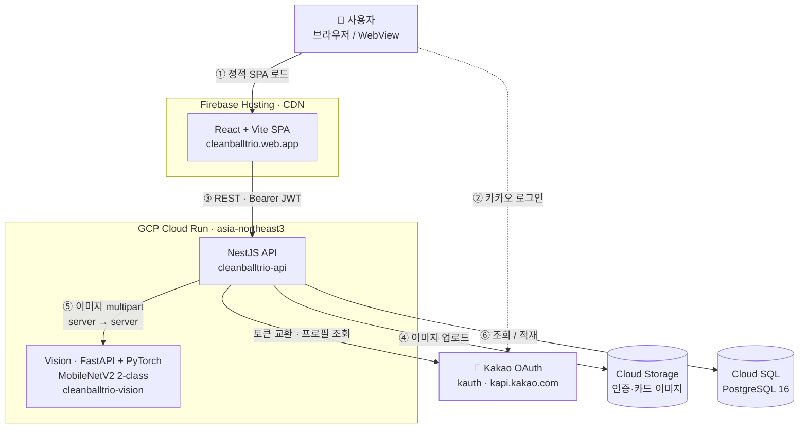

# 용기낼깡 ([한양대] 환경많이된다 팀)

> **야구장 일회용기 쓰레기 문제를, "직관 기념 카드"라는 재미요소로 푼다.**

**Live**: <https://cleanballtrio.web.app>

## 1. 문제 정의

KBO 한 시즌 약 **800만 명**이 직관하고 경기마다 수만 개의 일회용기가 쏟아지지만, 구장 다회용기 시범 운영의 **회수율은 낮다.** 두 가지가 맞물린 결과다.

- **반납 동기가 없다** — 반납해도 돌아오는 게 없으니 "그냥 버리는 게 빠르다"를 이기지 못한다.
- **기여를 증명할 수단이 없다** — 내가 다회용기를 쓰고 반납했다는 사실을 확인·기록할 방법이 없어, 보상도 경쟁도 설계할 수 없다.

## 2. 해결책

용기낼깡은 환경 행동에 **즉각적이고 소장 가치 있는 보상**을 붙인다. 핵심 메커니즘은 한 문장으로 요약된다 — **"다회용기를 인증해야, 그날의 직관 기념 카드(야구네컷)를 만들 수 있다."** 현금성 보상 대신 직관의 추억을 굿즈로 남기고 싶은 욕구를 동기로 활용한다.

| 문제                | 해결                                                                                   |
| ------------------- | -------------------------------------------------------------------------------------- |
| 사용 동기 부재      | 다회용기 인증 시 **그날 24시까지 '야구네컷' 직관 카드 제작이 잠금 해제** (인증 게이트) |
| 기여 인증 수단 부재 | **사진 1장 → Vision AI 자동 인증** (QR·운영사 협의 불필요)                             |
| 어뷰징 위험         | 카드 해제 기준은 **서버의 "오늘 CONFIRMED 인증" 기록** — 로컬 값 조작으로는 못 연다    |

## 3. 주요 기능 (유저 플로우)

### 1️⃣ 카카오로 시작

랜딩에서 "카카오로 시작하기" 한 번이면 바로 홈으로 들어간다. 별도 회원가입 절차가 없다.

### 2️⃣ 다회용기 인증 (홈 카메라)

홈 카메라로 내 다회용기를 촬영하면 AI가 **다회용기인지 일회용기인지 판별**하고, 사용자가 그 결과를 최종 확정해 인증을 마친다. (촬영 → AI 분석 → 확정의 2단계로, 오판을 사용자가 바로잡을 수 있다.)

### 3️⃣ 야구네컷 직관 카드 만들기

인증을 완료하면 **그날 자정까지 '야구네컷' 직관 카드가 열린다.** 같은 카메라에서 직관카드 모드로 전환해, 응원 구단 프레임을 골라 직관 사진을 합성하고 저장한다 — 환경 인증이 곧 그날의 기념 굿즈로 돌아온다.

### 4️⃣ 지도·캘린더로 직관 챙기기

**지도**에서 구장 안 다회용기 사용 매장과 메뉴를 찾고, **캘린더**에서 직관 일정과 내 인증 이력을 확인한다.

## 4. 시스템 아키텍처

프론트(React/Vite)는 Firebase Hosting CDN, API(NestJS)와 Vision(FastAPI)은 각각 Cloud Run(asia-northeast3)에 **분리 배포**된다. 브라우저는 카카오로 로그인하고, 이후 모든 요청은 Firebase → NestJS로 흐른다. 인증 이미지는 NestJS가 GCS에 적재하고 동시에 Vision으로 server-to-server 포워드한다.

## 5. ERD

`users`는 응원 팀(`teams`)에 소속되고, 인증 행위는 `usages`로 경기(`games`)와 함께 적재된다(스키마는 USE/RETURN·점수를 갖지만 현재 앱은 **USE 인증만** 기록). `verification_samples`는 AI 판정 + 사용자 라벨을 모으는 휴먼-인-더-루프 학습 테이블, `visit_cards`는 생성된 야구네컷 카드를 담는다. (매장·구장 관련 테이블은 지도 서브시스템으로 별도.)

## 6. 기술적 의사결정

| 결정        | 선택                                              | 왜                                                                                  |
| ----------- | ------------------------------------------------- | ----------------------------------------------------------------------------------- |
| 동기 설계   | **야구네컷 인증 게이트** (현금 보상 X)            | 환경 행동에 직관 굿즈라는 즉각·소장형 보상을 연결 — 인증이 곧 카드 해제             |
| 인증 방식   | **2단계 Vision AI (MobileNetV2)** vs QR           | QR 포맷 협의 의존성 제거 + 사용자 라벨 확정으로 오판 보정 & 재학습 데이터 축적      |
| 소셜 로그인 | **카카오 OAuth**                                  | 야구 직관러가 이미 쓰는 생태계 — 회원가입 마찰 최소화                               |
| 토큰        | **JWT (HS256, 7일)** + `sub = DB user.id`         | stateless 검증, 식별자 일원화로 인증 수단 확장 대비 (refresh는 만료 시 재로그인)    |
| 이미지 저장 | **Cloud Storage (GCS)**                           | 인증·카드 원본을 DB 밖에 두고 서명 경로로 스트리밍, 재학습 파이프라인 입력으로 활용 |
| 호스팅      | **Firebase Hosting + Cloud Run**                  | 단일 GCP 프로젝트로 통합 관리, 무료 티어로 학생 프로젝트 운영 부담 최소화           |
| CI/CD       | **GitHub Actions + Workload Identity Federation** | 장기 키 없이 OIDC + repo 조건부 SA 가장으로 보안 강화, 변경 영역만 자동 배포        |
