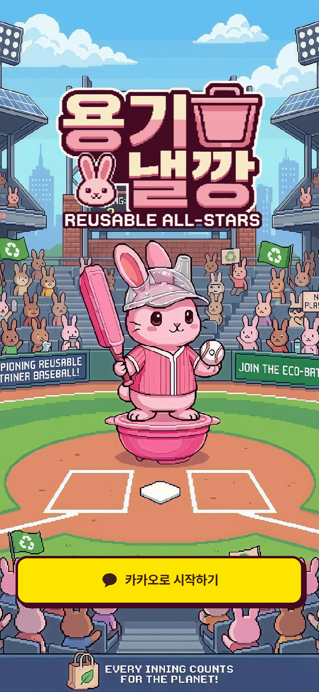
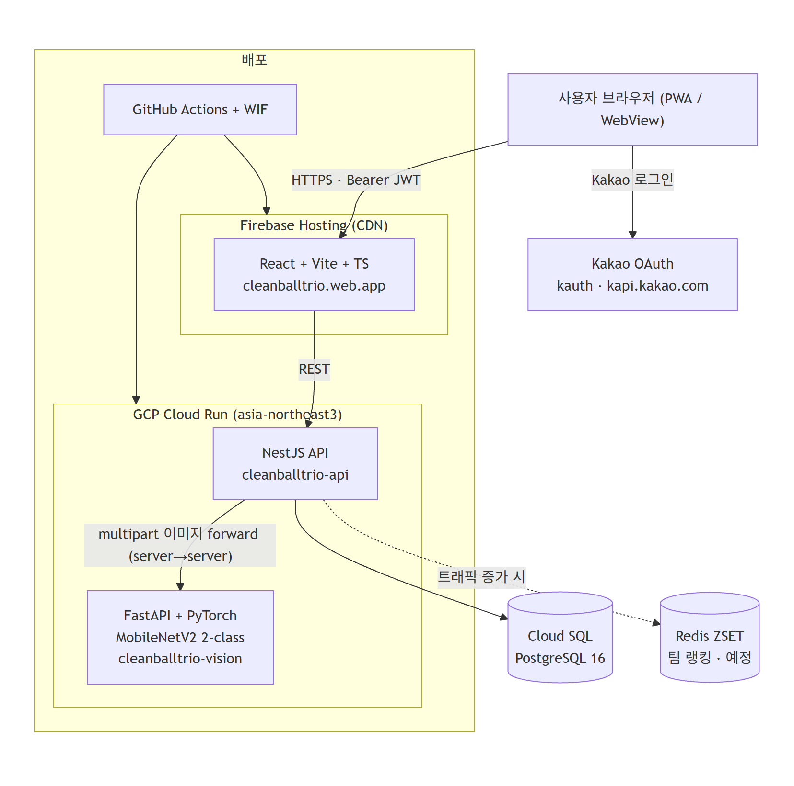
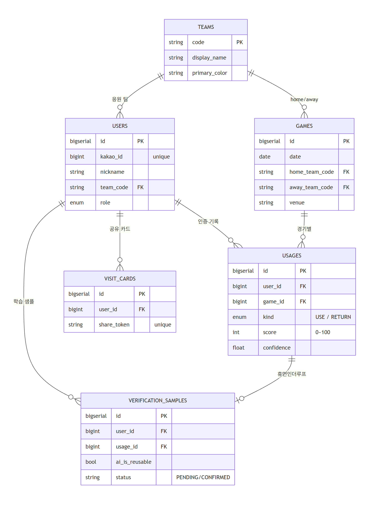

# 용기낼깡 (Clean Ball Trio)

> **야구장 일회용기 쓰레기 문제를, 응원 팀 경쟁으로 푼다.**

<div align="center">



[](https://github.com/hjo0225/kakao_techforimpact_campus/actions/workflows/deploy.yml)


**Live**: <https://cleanballtrio.web.app>

</div>

---

## 1. 프로젝트 개요

KBO 한 시즌 약 800만 명이 직관하며 경기마다 수만 개의 일회용기가 쏟아지지만, 구장 다회용기 시범 운영의 회수율은 낮다. 원인은 **반납 동기 부재**와 **기여를 확인할 인증 수단의 부재** — "그냥 버리는 게 빠르다"를 이기지 못한다. 용기낼깡은 다회용기 사용·반납을 *응원 팀 경쟁*으로 재정의해, 현금성 보상이 아닌 **팀 정체성(소속감)** 이라는 내재적 동기로 반납 행동을 끌어내는지 검증하는 프로젝트다. 사용자는 사진 한 장만 찍으면 AI가 인증하고, 점수는 곧 응원 팀의 누적 랭킹으로 환산된다.

## 2. 주요 기능 (기술적 난이도 중심)

### 🤖 Vision AI 이미지 분류 인증 (USE / RETURN)
QR 대신 다회용기 사진을 **MobileNetV2 2-class 모델**로 실시간 분류해, 운영사 QR 포맷 협의 의존성을 제거하고 사용자 UX를 사진 1장으로 단순화했다. 반납 인증은 동일 사용자의 최근 12시간 USE 기록이 있어야만 통과하는 비즈니스 가드를 둬 어뷰징을 차단한다. Vision은 별도 Cloud Run 서비스(FastAPI+PyTorch)로 분리하고 NestJS가 multipart 이미지를 server-to-server로 포워드한다.

### 🏆 팀별 누적 랭킹
현재는 PostgreSQL aggregate(`teams ⋈ users ⋈ usages`)로 매 요청마다 10개 팀을 점수순 정렬해 반환하며, 동점은 팀코드로 결정적 정렬한다. 트래픽 증가 시 Redis ZSET(`ranking:teams:season:{year}`)으로 전환할 수 있도록 읽기 경로를 격리해 두었다.

### 🔐 카카오 OAuth → 팀 온보딩 → JWT 발급
카카오 OAuth code를 백엔드에서 토큰 교환·프로필 조회 후 `kakao_id`로 자동 upsert하고, JWT `sub`를 카카오 ID가 아닌 **백엔드 DB user.id** 로 설정해 식별자를 일원화(추후 인증 수단 확장 대비)했다. 첫 로그인 시 응원 팀 선택을 강제한다.

## 3. 시스템 아키텍처

프론트(React/Vite)는 Firebase Hosting CDN, API(NestJS)와 Vision(FastAPI)은 각각 Cloud Run에 분리 배포된다. 카카오 OAuth로 인증하고, 이미지 인증 요청만 NestJS → Vision으로 내부 포워드한다.



> 선택 근거: [`docs/adr/0001-firebase-hosting-and-cloud-run.md`](docs/adr/0001-firebase-hosting-and-cloud-run.md)

## 4. ERD

`users`는 응원 팀(`teams`)에 소속되고, 인증 행위는 `usages`(USE/RETURN, 점수)로 경기(`games`)와 함께 적재된다. `verification_samples`는 AI 판정 + 사용자 라벨을 모으는 휴먼-인-더-루프 학습 테이블이다.



## 5. 기술적 의사결정

| 결정 | 선택 | 왜 |
|---|---|---|
| 소셜 로그인 | **카카오 OAuth** | 야구 직관러가 이미 쓰는 생태계 — 회원가입 마찰 최소화 |
| 토큰 | **JWT (HS256, 7일)** + `sub = DB user.id` | stateless 검증, 식별자 일원화로 인증 수단 확장 대비 (refresh는 만료 시 재로그인) |
| 인증 방식 | **Vision AI (MobileNetV2)** vs QR | QR 포맷 협의 의존성 제거 + 학습 데이터 축적(`verification_samples`) |
| 랭킹 | **PG aggregate** (Redis 보류) | MVP 행 수에서는 충분, 지연 발생 시 Redis ZSET 전환 |
| 호스팅 | **Firebase Hosting + Cloud Run** | 단일 GCP 프로젝트로 통합 관리, 무료 티어로 학생 프로젝트 운영 부담 최소화 |
| CI/CD | **GitHub Actions + Workload Identity Federation** | 장기 키 없이 OIDC + repo 조건부 SA 가장으로 보안 강화, 변경 영역만 자동 배포 |

---

### Live & 인프라

| | URL |
|---|---|
| 앱 (Firebase Hosting) | https://cleanballtrio.web.app |
| API (Cloud Run, asia-northeast3) | https://cleanballtrio-api-fpvvjohnta-du.a.run.app |

### 로컬 실행 (요약)

```bash
cd backend  && npm install && cp .env.example .env && npm run start:dev   # :3002
cd frontend && npm install && cp .env.example .env && npm run dev          # :5173 (포트 고정 — 카카오 redirect_uri/CORS)
cd vision   && pip install -r requirements.txt && uvicorn app:app --port 8000  # 이미지 인증 테스트 시
```

### 문서

[`docs/PRD.md`](docs/PRD.md) · [`docs/ARCHITECTURE.md`](docs/ARCHITECTURE.md) · [`docs/api-spec.md`](docs/api-spec.md) · [`docs/DATA_MODEL.md`](docs/DATA_MODEL.md) · [`docs/adr/`](docs/adr/) · [`DESIGN.md`](DESIGN.md)
